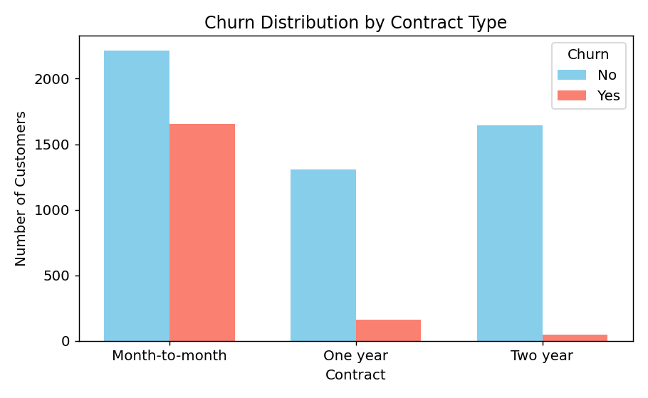
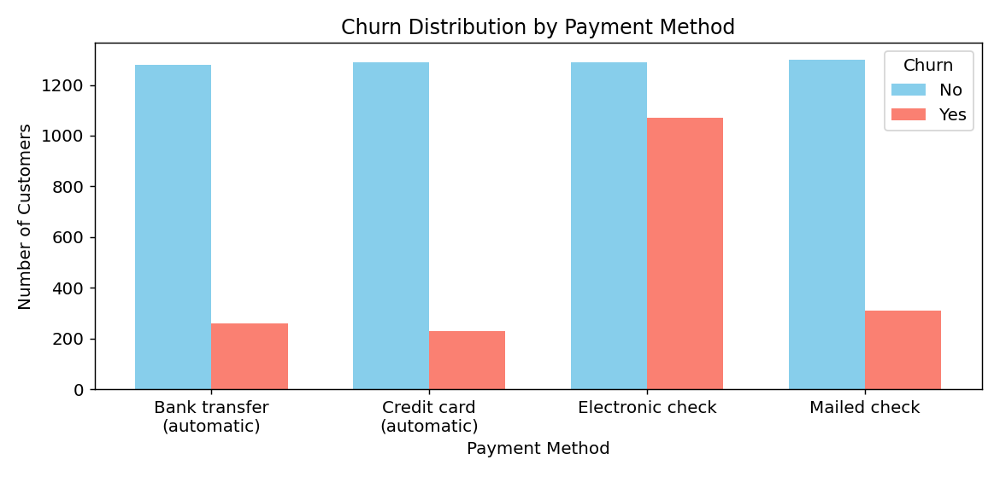
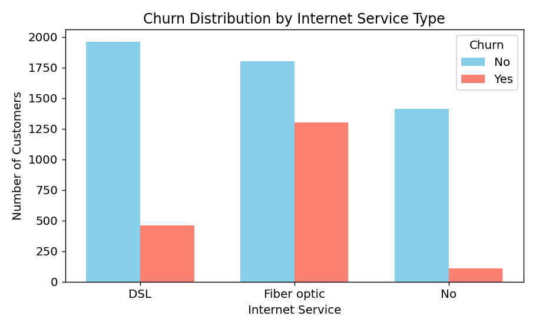
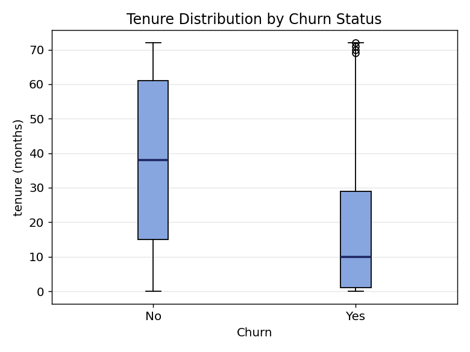
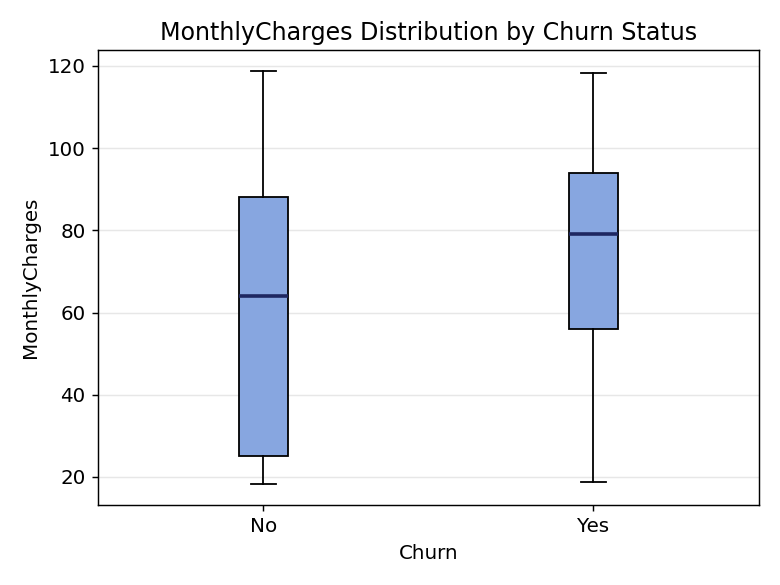
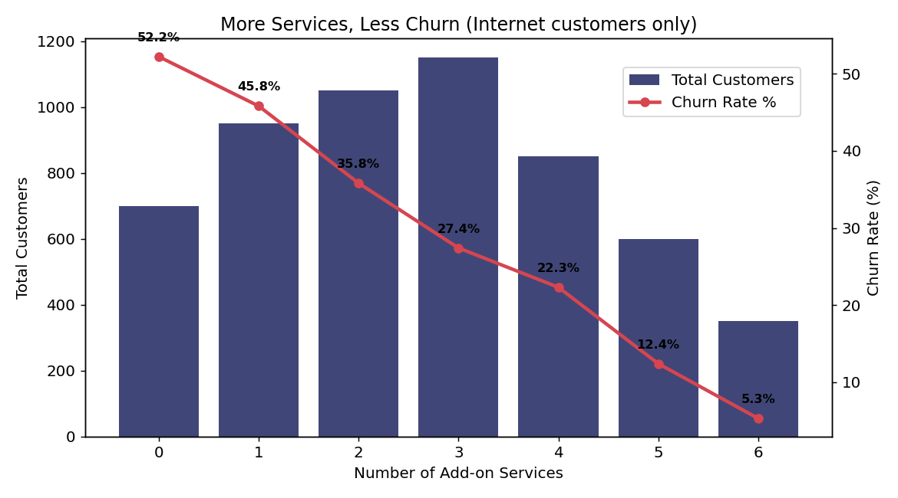
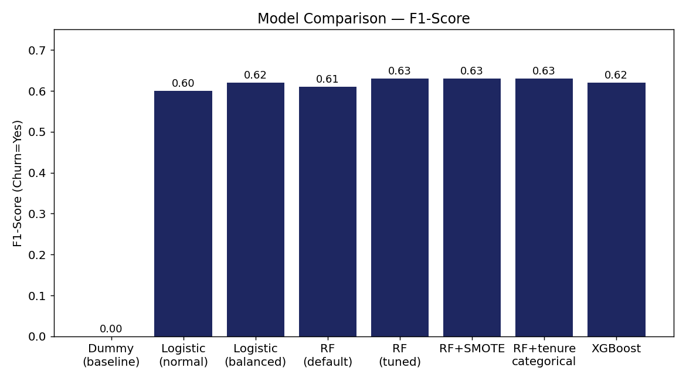
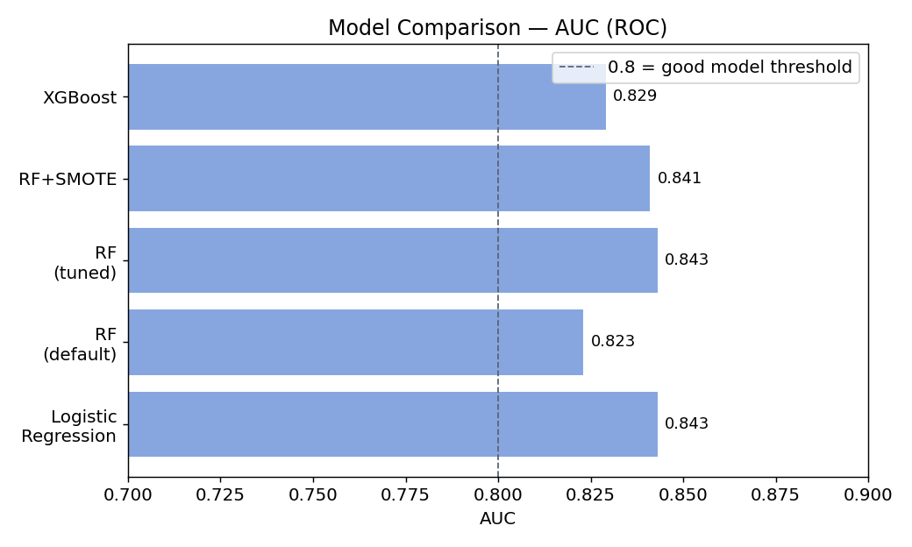
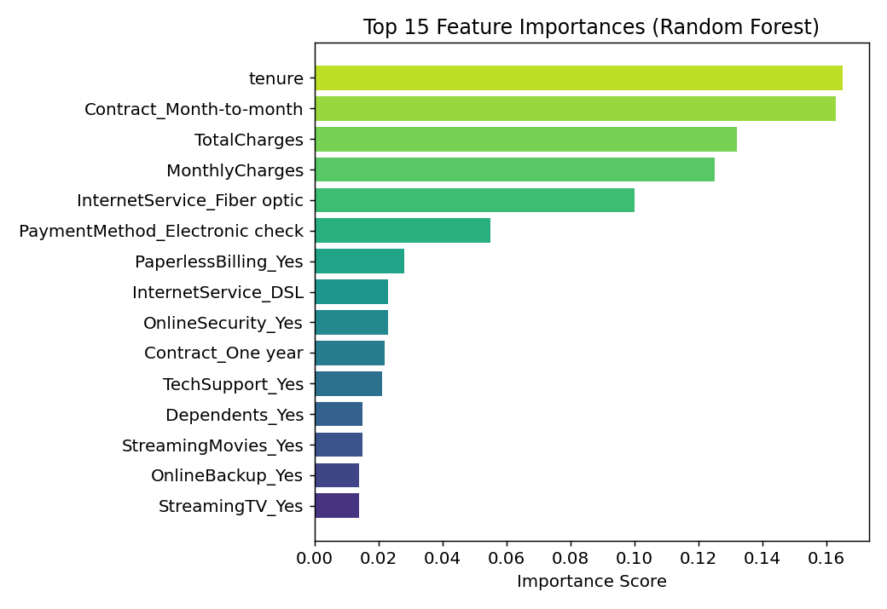
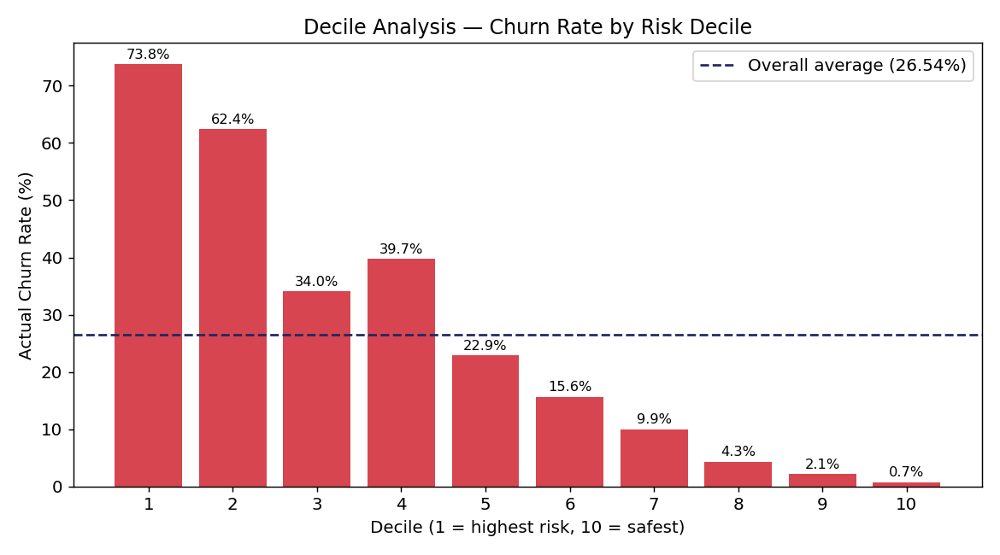

# Telco Customer Churn — Analysis & Dashboard Project

An end-to-end data project that uses a telecom company's customer data to **predict customer churn** with a machine learning model, and turns the findings into business decisions through an interactive **Power BI dashboard**.

---

## 📁 Project Structure

```
telco-customer-churn/
├── .gitignore
├── README.md
├── images/                     # charts referenced in this README
├── data/
│   └── WA_Fn-UseC_-Telco-Customer-Churn.csv
├── notebooks/
│   └── data_cleaning.ipynb
├── reports/
│   ├── Telco_Churn_Analysis_Report.docx / .pdf
│   ├── Telco_Churn_Detailed_Process_Guide.docx / .pdf
│   └── Telco_Churn_Presentation.pptx
└── dashboard/
    └── telco_churn_dashboard.pbix
```

> **Note on the charts below:** all figures in this README are re-generated from the exact numbers produced during the original analysis (bar counts, correlation coefficients, feature-importance scores, decile percentages, F1/AUC scores). The full correlation heatmap and the point-by-point ROC curve shape were not preserved as raw data, so — rather than fabricate a curve or a full matrix — this README shows the same information as bar charts, using only the specific numeric values that were actually recorded.

---

## 🎯 Project Goal

Predict which customers are likely to churn (`Churn`) so the company can proactively offer retention campaigns to at-risk customers.

- **Dataset:** 7,043 customers, 21 variables
- **Overall churn rate:** 26.5% (imbalanced dataset)
- **Approach:** Data cleaning → EDA → Correlation analysis → ML modeling → Business-focused segmentation (decile analysis)
- **Result:** A tuned Random Forest model (GridSearch-optimized) reaches an AUC of 0.843 and reliably ranks churn risk; targeting just the riskiest 40% of customers captures ~79% of actual churners.

---

## 🧹 1. Data Cleaning (Python / Jupyter Notebook)

### Issue found: the `TotalCharges` column

- The column showed up as text (`str`), not numeric (`float`).
- `(df['TotalCharges'] == "").sum()` → 0 (no fully empty cells)
- `(df['TotalCharges'].str.strip() == "").sum()` → 11 (cells containing only a space character!)
- Root cause: all 11 of these rows had `tenure = 0` — brand-new customers who hadn't been billed yet.

**Fix:**
```python
df['TotalCharges'] = pd.to_numeric(df['TotalCharges'], errors='coerce')
df['TotalCharges'] = df['TotalCharges'].fillna(0)
```

### Other cleaning steps
- Dropped `customerID` (unique per row, no predictive value).
- Removed redundant / multicollinear one-hot columns (`No internet service`, `No phone service` categories duplicated across multiple sub-service columns).
- Verified consistency between `InternetService`/`PhoneService` and their dependent sub-service columns (`OnlineSecurity`, `TechSupport`, etc.).

---

## 📊 2. Exploratory Data Analysis — Key Findings

| Variable | Riskiest category | Churn rate | Effect strength |
|---|---|---|---|
| **Contract** | Month-to-month | ~43% | Very strong |
| **tenure** | New customers | High | Very strong |
| **PaymentMethod** | Electronic check | ~45% | Strong |
| **OnlineSecurity / TechSupport** | Customers without the service | 40–42% | Strong |
| **InternetService** | Fiber optic | ~42% | Moderate |
| **MonthlyCharges** | Higher bill | Moderate | Moderate |
| **gender** | — | 26.2–26.9% | None |

### Churn by contract type


### Churn by payment method


### Churn by internet service type


### Tenure distribution by churn status


### MonthlyCharges distribution by churn status


### Add-on services and loyalty
Among customers who *do* have internet service, churn drops steadily as the number of add-on services (OnlineSecurity, TechSupport, StreamingTV, etc.) increases — from 52.2% with zero add-ons down to 5.3% with all six.



---

## 🔗 3. Correlation with Churn

After one-hot encoding and removing multicollinear/duplicate columns, the strongest linear relationships with `Churn` were:


**Interesting detail:** `TotalCharges` is *negatively* correlated with churn (−0.20) even though `MonthlyCharges` is positively correlated (+0.19) — because `TotalCharges` is strongly tied to `tenure` (0.83 correlation), and long-tenured, low-risk customers simply accumulate higher totals over time.

---

## 🤖 4. Modeling — 8 Scenarios Compared

| Model | Accuracy | Precision | Recall | F1 | AUC |
|---|---|---|---|---|---|
| Dummy Classifier (baseline) | 0.735 | 0.00 | 0.00 | 0.00 | — |
| Logistic Regression (default) | 0.80 | 0.64 | 0.55 | 0.60 | 0.843 |
| Logistic Regression (balanced) | 0.74 | 0.51 | 0.79 | 0.62 | 0.843 |
| Random Forest (default) | 0.78 | 0.57 | 0.65 | 0.61 | 0.823 |
| **Random Forest (tuned)** ⭐ | 0.76 | 0.53 | 0.77 | **0.63** | **0.843** |
| Random Forest (tuned) + SMOTE | 0.78 | 0.57 | 0.71 | 0.63 | 0.841 |
| Random Forest (tuned) + tenure as category | 0.757 | 0.53 | 0.78 | 0.63 | 0.841 |
| XGBoost | 0.76 | 0.54 | 0.75 | 0.62 | 0.829 |




**Hyperparameter tuning:** GridSearchCV, 108 combinations × 5-fold CV = 540 model fits.
Best parameters: `max_depth=10, min_samples_leaf=2, min_samples_split=10, n_estimators=200`

**Overfitting check (train vs. test accuracy gap):** Logistic Regression was the most stable (0.5–1.3 point gap), while XGBoost overfit the most (10.6-point gap), since it wasn't hyperparameter-tuned.

### Feature importance (Random Forest)


---

## 🎯 5. Decile Analysis — Business Value

Customers were ranked by predicted churn probability and split into 10 equal deciles:



> **Bottom line:** Targeting just the riskiest 40% of customers (564 people) captures roughly **79%** of all actual churners. Lift = 2.78 in the top decile; KS statistic = 0.53 (at decile 4) — the point of maximum separation between churners and non-churners.

---

## 📈 6. Power BI Dashboard

### Pages
- **Home** — overview
- **Executive Churn Summary** — top-level KPIs and trends
- **Product and Support Services Details** — service-level churn breakdown
- **Customer Retention & Action List** — ranked list of at-risk / high-value customers
- **Demographic & Household Profile** — demographic cuts
- **Key Influencers** — Power BI's built-in AI visual for churn drivers

### ⚠️ Data Issue Found & Fixed

While building the dashboard, `MonthlyCharges` and `TotalCharges` displayed impossibly large totals (millions/billions instead of thousands).

- **Symptom:** A value like `118.75` was showing up as `11875` — the decimal point had effectively disappeared.
- **Root cause:** In Power Query, the column type conversion (`Change Type`) wasn't given an explicit locale. The source data uses `.` as the decimal separator (US format); without specifying that locale, Power Query didn't recognize the `.` as a decimal point and stripped it, turning `118.75` into `11875`.
- **Fix:** In Power Query Editor, right-click the column → `Change Type` → `Using Locale...` → Data Type: `Decimal Number`, Locale: `English (United States)` — applied at the **earliest** point the column is converted, not a later, redundant step.
- **Verification:** Sorted `TotalCharges` descending in Data view and confirmed the maximum was ~8,684 (the known true maximum), not hundreds of thousands.

> **Lesson learned:** When a visual shows implausibly large numbers, check in this order: (1) is the raw data correct in Data view, (2) is the Details/granularity field set correctly, (3) is the aggregation type (Sum/Average) correct, (4) is the visual object itself using a stale reference (deleting and recreating it can fix this). Also note: in the Turkish Power BI UI, **"B" means "Bin" (thousand), not "Billion"** — worth remembering before assuming a formatting bug that isn't there.

### Design notes
- Removed decorative background template images that were interfering with data readability.
- Rewrote chart titles from neutral descriptions to **finding-driven** headlines (e.g., "Customer Lifecycle Curve" → "Churn Risk by Tenure and Spending").
- Adjusted the color palette for better contrast between categories.

---

## 🔧 Tools Used

- **Python:** pandas, numpy, matplotlib, seaborn, scikit-learn, imbalanced-learn (SMOTE), xgboost
- **Power BI Desktop:** Power Query (M), DAX measures, interactive dashboard
- **Other:** GridSearchCV (hyperparameter tuning), joblib (model persistence)

---

## 🚀 Reusing the Model

```python
import joblib

# Load the trained model
model = joblib.load('best_rf_model.pkl')

# Predict on new data
predictions = model.predict(X_new)
probabilities = model.predict_proba(X_new)[:, 1]  # churn probability
```

---

## 📌 Future Work

- [ ] Compare Random Undersampling against SMOTE and class_weight
- [ ] Try Voting/Stacking ensemble models
- [ ] Compare performance with normalized numeric features (MinMaxScaler)
- [ ] Incorporate additional data sources (e.g., customer complaints/satisfaction surveys)
- [ ] Run hyperparameter tuning for XGBoost as well

---

## 📄 License / Data Source

Dataset: `WA_Fn-UseC_-Telco-Customer-Churn.csv` (IBM sample dataset, widely shared via Kaggle).
